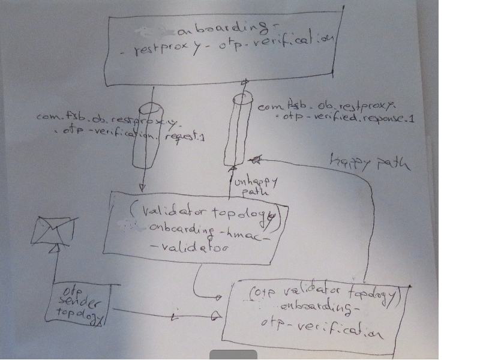

# restproxy-otp-verification

## Description: 
The restproxy-otp-verification is a micro-service that runs as a Spring Boot application.

It exposes an endpoint that collect all the requests coming from customer's mobile apps, and it is used
for registering customer device. A few tasks will be handled by this micro-service:

1) End point definition based on swagger specification stored in the  `rest-api-specs`project: 


2) Parsing the request parameters and validating it.
3) Converting the params into Event Avro message.
4) Publish the message in the requests topic.
5) Listening on the response topic for corresponding results.
6) Converting avro to json and return the results.

That's the diagram of what we want to achieve:



## Technologies: 
* Java 11 version
* Kafka 1.0.1
* Spring Boot

## /actuator/prometheus endpoint enabled

Prometheus server will be polling our microservice's endpoint every n seconds in order to collect our metrics and put them
in the Grafana Kafka dashboards:

```bash
$ curl http://localhost:8018/actuator/prometheus | grep kafka
100 23406  100 23406    # HELP kafka_consumer_sync_time_avg_seconds The average time taken for a group sync.
0 # TYPE kafka_consumer_sync_time_avg_seconds gauge
   kafka_consumer_sync_time_avg_seconds{client_id="restproxy-otp-verification-ad7f3594-0da8-4a59-b82d-48912d8a915b-StreamThread-1-consumer",} 0.004
 0 # HELP kafka_consumer_records_lag_records The latest lag of the partition
 1# TYPE kafka_consumer_records_lag_records gauge
904k kafka_consumer_records_lag_records{client_id="restproxy-otp-verification-ad7f3594-0da8-4a59-b82d-48912d8a915b-StreamThread-1-consumer",partition="0",topic="com_tsb_ob_restproxy_otp_verified_response",} 0.0
     0# HELP kafka_consumer_fetch_throttle_time_avg_seconds The average throttle time. When quotas are enabled, the broker may delay fetch requests in order to throttle a consumer which has exceeded its limit. This metric indicates how throttling time has been added to fetch requests on average.
...
```
## Build locally

1) Build the project:

```shell script
./gradlew clean build
```

## Test locally

### Start Kafka local environment:

You can choose different alternatives, for example:

* Start downloaded Confluent platform:

```shell script
$ export CONFLUENT_HOME=~/Downloads/confluent-6.0.0/

$ confluent local services start
The local commands are intended for a single-node development environment only,
NOT for production usage. https://docs.confluent.io/current/cli/index.html

Using CONFLUENT_CURRENT: /tmp/confluent.128165
Starting ZooKeeper
ZooKeeper is [UP]
Starting Kafka
Kafka is [UP]
Starting Schema Registry
Schema Registry is [UP]
Starting Kafka REST
Kafka REST is [UP]
Starting Connect
Connect is [UP]
Starting ksqlDB Server
ksqlDB Server is [UP]
Starting Control Center
Control Center is [UP]
```

* Start your Kafka local environment in Docker:

```shell script
$ sudo docker-compose -f docker-compose.yml up -d
Starting tsbonboardingrestproxyotpverification_zoonavigator_1 ... done
Starting zookeeper                                          ... done
Starting broker                                             ... done
Starting schema-registry                                    ... done
Starting control-center                                     ... done

$ sudo docker-compose ps
                       Name                                   Command               State                         Ports                   
------------------------------------------------------------------------------------------------------------------------------------------
broker                                               /etc/confluent/docker/run   Up             0.0.0.0:9092->9092/tcp                    
control-center                                       /etc/confluent/docker/run   Up             0.0.0.0:9021->9021/tcp                    
schema-registry                                      /etc/confluent/docker/run   Up             0.0.0.0:8081->8081/tcp                    
tsbonboardingrestproxyotpverification_zoonavigator_1   ./run.sh                    Up (healthy)   0.0.0.0:8000->8000/tcp, 9000/tcp          
zookeeper                                            /etc/confluent/docker/run   Up             0.0.0.0:2181->2181/tcp, 2888/tcp, 3888/tcp
```

Create the topology topics as seen in the application.yml configuration file, i.e:

* sink: com.tsb.ob.restproxy.request.dev
  *Note*: this topic name must match with the input topic of the "otp-verification" project

```shell script
$ ~/Downloads/confluent-5.1.0/bin/kafka-topics --create \
           --topic com.tsb.ob.restproxy.request.dev \
           --partitions 1 --replication-factor 1 --zookeeper localhost:2181
```
  
* source: com.tsb.ob.restproxy.otp.verified.response.dev
  *Note*: this topic name must match with the output topic of the "otp-verification" project

```shell script
$ ~/Downloads/confluent-5.1.0/bin/kafka-topics --create \
            --topic com.tsb.ob.restproxy.otp.verified.response.dev \
            --partitions 1 --replication-factor 1 --zookeeper localhost:2181
```

Start the application locally using Gradle:

```shell script
$ ./gradlew bootRun --args='--spring.profiles.active=local'
```

Alternatively, you can start the application using Java:

```shell script

$ java -jar build/libs/restproxy-otp-verification-1.0.jar \
            --spring.config.name=src/main/resources/application-dev.yml \
            --spring.config.location=src/main/resources/application-dev.yml 

  .   ____          _            __ _ _
 /\\ / ___'_ __ _ _(_)_ __  __ _ \ \ \ \
( ( )\___ | '_ | '_| | '_ \/ _` | \ \ \ \
 \\/  ___)| |_)| | | | | || (_| |  ) ) ) )
  '  |____| .__|_| |_|_| |_\__, | / / / /
 =========|_|==============|___/=/_/_/_/
 :: Spring Boot ::        (v2.2.5.RELEASE)

2020-03-20 06:44:27,196 INFO  [main] boot.StartupInfoLogger (StartupInfoLogger.java:55) - Starting OtpVerificationRestProxyApp on QOSMIO-X70B with PID 23159 (/home/arturotarin/Documents/2020-03-11_TSB/TSBGitHubRepo/restproxy-otp-verification/build/classes/java/main started by arturotarin in /home/arturotarin/Documents/2020-03-11_TSB/TSBGitHubRepo/restproxy-otp-verification)
2020-03-20 06:44:29,387 INFO  [restproxy-otp-verification-00a606ca-df07-404c-8b72-c6fbf0a5a938-StreamThread-1] utils.LogContext$KafkaLogger (LogContext.java:351) - stream-thread [restproxy-otp-verification-00a606ca-df07-404c-8b72-c6fbf0a5a938-StreamThread-1] partition assignment took 1 ms.
        current active tasks: []
        current standby tasks: []
        previous active tasks: []

2020-03-20 06:44:29,488 INFO  [restproxy-otp-verification-00a606ca-df07-404c-8b72-c6fbf0a5a938-StreamThread-1] utils.LogContext$KafkaLogger (LogContext.java:346) - stream-thread [restproxy-otp-verification-00a606ca-df07-404c-8b72-c6fbf0a5a938-StreamThread-1] State transition from PARTITIONS_ASSIGNED to RUNNING
2020-03-20 06:44:29,489 INFO  [restproxy-otp-verification-00a606ca-df07-404c-8b72-c6fbf0a5a938-StreamThread-1] utils.LogContext$KafkaLogger (LogContext.java:346) - stream-client [restproxy-otp-verification-00a606ca-df07-404c-8b72-c6fbf0a5a938]State transition from REBALANCING to RUNNING
```

Next, call the rest endpoint api, this must run the end to end cycle, creating messages in the request Kafka topic:

```shell script
$ curl -s -X POST -H "Content-Type: application/json" \
                --header "X-Authorization-HMAC: 1234" \
   --data '{"otp": "234567"}' http://localhost:8085/users/userid1234/phone/verify | jq
```    

We can see that the messages has been produced in the request topic in Avro format if we have the Confluent bundle:

```shell script
$ ~/Downloads/confluent-5.1.0/bin/kafka-avro-console-consumer \
  --topic com.tsb.ob.restproxy.request.dev --bootstrap-server localhost:9092 --from-beginning

{"correlationId":"24f28af6-a609-40b0-9632-ee4e93301b7b","createdAt":1585115611479,"createdBy":"restproxy-otp-verification-1","type":"OTP_VALIDATION","requestParams":{"string":"{\"otp\":\"234567\",\"xAuthorizationHMAC\":\"1234\",\"userId\":\"userid1234\"}"},"replyTo":"com.tsb.ob.restproxy.otp.verified.response.dev","userId":"userid1234","hmac":"1234"}
```

We can also use the *broker* host:

```shell script
$ docker exec -it broker kafka-console-consumer   \
              --topic com.tsb.ob.restproxy.request.dev --bootstrap-server localhost:9092 --from-beginning
24f28af6-a609-40b0-9632-ee4e93301b7b�����\8restproxy-otp-verification-1�{"otp":"234567","xAuthorizationHMAC":"1234","userId":"userid1234"}Xcom.tsb.ob.restproxy.otp.verified.response.devuserid1231234
```

As seen in the first diagram, after the `restproxy-otp-verification` microservice publishes a message in the com.tsb.ob.restproxy.request.dev topic, the next step in
  a real production environment would be in hands of the `hmac-validator`
 microservice, who eventually will be picking up the message from this topic, then evaluating the Hmac
 value contained in the "hmac" field within the message, and then either inserting a 422 error message
in the com.tsb.ob.restproxy.otp.verified.response.dev topic in case the Hmac is not valid, or moving forward the
process to the otp-verification in case the Hmac is valid.

But we are in the test environment, and running the hmac-validator and the otp-verification
microservices all together with this `otp-verification`
 microservice that we want to test, plus the full docker Kafka environment, is highly system resources consuming.

`avro-schema` is the project to manage the Avro messages published in the topic.

Having said that, we can do a workaround to surpass this limitation, which basically is manually publishing
fake messages in the com.tsb.ob.restproxy.otp.verified.response.dev topic using the kafka-avro-console-producer
command line, in order to simulate the full end-to-end test cycle. The provided schema would be as seen
in the `AuthEventResponse.avsc`
 Avro schema created in the `avro-schema' project.
 
Running this command would be as if the otp-verification microservice returned a 200 OK response:
 
 ```shell script
 $ cat src/test/resources/AuthEventResponse_200.json | ~/Downloads/confluent-5.1.0/bin/kafka-avro-console-producer         --broker-list localhost:9092 --topic com.tsb.ob.tp.validation.passed     --property schema.registry.url=http://127.0.0.1:8081     --property value.schema="$(cat src/test/resources/AuthEventResponse.avsc)"
 ``` 

Running this command would be as if the otp-verification microservice returned a 422 UNPROCESSABLE_ENTITY response:

 ```shell script
 $ cat src/test/resources/AuthEventResponse_422.json | ~/Downloads/confluent-5.1.0/bin/kafka-avro-console-producer         --broker-list localhost:9092 --topic com.tsb.ob.tp.validation.passed     --property schema.registry.url=http://127.0.0.1:8081     --property value.schema="$(cat src/test/resources/AuthEventResponse.avsc)"
 ``` 

## Deploying the application in a local Docker environment

### Creating a Docker container image with the resulting jar application

```shell script
$ sudo docker build -t restproxy-otp-verification .
Sending build context to Docker daemon  75.17MB
Step 1/9 : FROM openjdk:11.0.2-jre-slim AS builder
 ---> b7a931ed7d37
Step 2/9 : ENV ARTIFACT_NAME restproxy-otp-verification-1.0.jar
 ---> Running in c28e8e919de5
 ---> 8c0717918c11
Removing intermediate container c28e8e919de5
Step 3/9 : ENV APP_HOME /usr/app/
 ---> Running in 31f1cacb5a8e
 ---> 5aada6c95a98
Removing intermediate container 31f1cacb5a8e
Step 4/9 : WORKDIR $APP_HOME
 ---> 3d17efbd0889
Removing intermediate container 9cd8531e8f7a
Step 5/9 : COPY build/libs/$ARTIFACT_NAME $APP_HOME
 ---> 7e388d75b573
Removing intermediate container 4c1a776654ec
Step 6/9 : EXPOSE 8085
 ---> Running in 96694e4f02f9
 ---> 7a1aa341915d
Removing intermediate container 96694e4f02f9
Step 7/9 : ENV STORE_ENABLED true
 ---> Running in a224c0ea4c3d
 ---> 9b1bf4f145f7
Removing intermediate container a224c0ea4c3d
Step 8/9 : ENV WORKER_ENABLED true
 ---> Running in 35cb690b2eb8
 ---> b8146cc2a8c9
Removing intermediate container 35cb690b2eb8
Step 9/9 : CMD java -jar $ARTIFACT_NAME
 ---> Running in 5955b643f91a
 ---> 307f1bc170b0
Removing intermediate container 5955b643f91a
Successfully built 307f1bc170b0
Successfully tagged restproxy-otp-verification:latest

$ docker images
REPOSITORY                                              TAG                 IMAGE ID            CREATED             SIZE
restproxy-otp-verification                 latest              8674e67adedb        30 seconds ago      578MB
```

### Running a Docker container based in the image

Create a new container:

```shell script
$ docker run -d --network=confluent-network -p 8085:8085 --name restproxy-otp-verification restproxy-otp-verification:latest
35e213f52f2b005cd9ca7ef8e4ea3166f99db3c40b0a7918d51d8cf7433eb82b
```

Check the container status:

```shell script
$ docker ps
CONTAINER ID        IMAGE                                            COMMAND                  CREATED             STATUS              PORTS                    NAMES
35e213f52f2b        restproxy-otp-verification:latest   "java -jar onb..."   17 seconds ago      Up 12 seconds       0.0.0.0:8085->8085/tcp   restproxy-otp-verification
```

See the container logs:

```shell script
$ docker logs -f restproxy-otp-verification

2020-03-17 08:15:12,625 INFO  [restproxy-otp-verification-43ec16ba-e353-414b-b433-8f464b8c1d6b-StreamThread-1] utils.LogContext$KafkaLogger (LogContext.java:346) - stream-client [restproxy-otp-verification-43ec16ba-e353-414b-b433-8f464b8c1d6b]State transition from REBALANCING to RUNNING
```

Stop the container:

```shell script
$ docker stop restproxy-otp-verification
restproxy-otp-verification
```

Start the container:

```shell script
$ docker start restproxy-otp-verification
restproxy-otp-verification
```

```shell script
$ docker-compose up -d restproxy-otp-verification
Recreating restproxyotpverification_restproxy-otp-verification_1 ... done
```

## Deploying the application in a local Kubernetes (Minikube)

### Configuring your local Kubernetes environment

You must have a Minikube installed, up and running:

```shell script
$ minikube start \
    --memory 5192 \
    --extra-config=controller-manager.horizontal-pod-autoscaler-upscale-delay=1m \
    --extra-config=controller-manager.horizontal-pod-autoscaler-downscale-delay=2m \
    --extra-config=controller-manager.horizontal-pod-autoscaler-sync-period=10s
* minikube v1.8.2 on Ubuntu 16.04
  - MINIKUBE_ACTIVE_DOCKERD=minikube
* Automatically selected the kvm2 driver. Other choices: docker, none
* Creating kvm2 VM (CPUs=2, Memory=5192MB, Disk=20000MB) ...
* Preparing Kubernetes v1.17.3 on Docker 19.03.6 ...
  - controller-manager.horizontal-pod-autoscaler-upscale-delay=1m
  - controller-manager.horizontal-pod-autoscaler-downscale-delay=2m
  - controller-manager.horizontal-pod-autoscaler-sync-period=10s
* Launching Kubernetes ... 
* Enabling addons: default-storageclass, storage-provisioner
* Waiting for cluster to come online ...
* Done! kubectl is now configured to use "minikube"

$ minikube docker-env
export DOCKER_TLS_VERIFY="1"
export DOCKER_HOST="tcp://192.168.39.155:2376"
export DOCKER_CERT_PATH="/home/arturotarin/.minikube/certs"
export MINIKUBE_ACTIVE_DOCKERD="minikube"

# To point your shell to minikube's docker-daemon, run:
# eval $(minikube -p minikube docker-env)
``` 

If we are curious we can get into the machine:


```shell script
$ ssh docker@192.168.39.155
docker@192.168.39.155's password: tcuser
                         _             _            
            _         _ ( )           ( )           
  ___ ___  (_)  ___  (_)| |/')  _   _ | |_      __  
/' _ ` _ `\| |/' _ `\| || , <  ( ) ( )| '_`\  /'__`\
| ( ) ( ) || || ( ) || || |\`\ | (_) || |_) )(  ___/
(_) (_) (_)(_)(_) (_)(_)(_) (_)`\___/'(_,__/'`\____)

$ 
```

Launch the Kubernetes Dashboard:

```shell script
$ minikube dashboard &
* Verifying dashboard health ...
* Launching proxy ...
* Verifying proxy health ...
* Opening http://127.0.0.1:46545/api/v1/namespaces/kubernetes-dashboard/services/http:kubernetes-dashboard:/proxy/ in your default browser...
```


Then, enable the metrics-server addon:

```shell script
$ minikube addons enable metrics-server
* The 'metrics-server' addon is enabled

$ minikube addons enable registry
* The 'registry' addon is enabled

$ minikube addons enable helm-tiller
* The 'helm-tiller' addon is enabled

$ minikube addons enable ingress
* The 'ingress' addon is enabled

$ minikube addons enable ingress-dns
* The 'ingress-dns' addon is enabled

$ minikube addons enable logviewer
* The 'logviewer' addon is enabled


$ minikube addons list
|-----------------------------|----------|--------------|
|         ADDON NAME          | PROFILE  |    STATUS    |
|-----------------------------|----------|--------------|
| dashboard                   | minikube | enabled ✅   |
| default-storageclass        | minikube | enabled ✅   |
| efk                         | minikube | disabled     |
| freshpod                    | minikube | disabled     |
| gvisor                      | minikube | disabled     |
| helm-tiller                 | minikube | enabled ✅   |
| ingress                     | minikube | enabled ✅   |
| ingress-dns                 | minikube | enabled ✅   |
| istio                       | minikube | disabled     |
| istio-provisioner           | minikube | disabled     |
| logviewer                   | minikube | enabled ✅   |
| metrics-server              | minikube | enabled ✅   |
| nvidia-driver-installer     | minikube | disabled     |
| nvidia-gpu-device-plugin    | minikube | disabled     |
| registry                    | minikube | enabled ✅   |
| registry-creds              | minikube | disabled     |
| storage-provisioner         | minikube | enabled ✅   |
| storage-provisioner-gluster | minikube | disabled     |
|-----------------------------|----------|--------------|
```

```shell script
$ kubectl get pod,svc -n kube-system
NAME                                  READY   STATUS    RESTARTS   AGE
pod/coredns-6955765f44-5tsdc                    1/1     Running             0          8m28s
pod/coredns-6955765f44-f59jk                    1/1     Running             0          8m28s
pod/etcd-m01                                    1/1     Running             0          8m47s
pod/kube-apiserver-m01                          1/1     Running             0          8m47s
pod/kube-controller-manager-m01                 1/1     Running             0          8m46s
pod/kube-ingress-dns-minikube                   1/1     Running             0          2m55s
pod/kube-proxy-qs2dn                            1/1     Running             0          8m28s
pod/kube-scheduler-m01                          1/1     Running             0          8m46s
pod/metrics-server-6754dbc9df-k5849             1/1     Running             0          5m40s
pod/nginx-ingress-controller-6fc5bcc8c9-hjfg8   1/1     Running             0          3m2s
pod/registry-5qgk5                              1/1     Running             0          5m30s
pod/registry-creds-6cc44679-hsrbg               1/1     Running             0          5m20s
pod/registry-proxy-859q4                        1/1     Running             0          5m27s
pod/storage-provisioner                         1/1     Running             0          8m39s
pod/tiller-deploy-969865475-pz9db               1/1     Running             0          3m51s

NAME                     TYPE        CLUSTER-IP       EXTERNAL-IP   PORT(S)                  AGE
service/kube-dns         ClusterIP   10.96.0.10       <none>        53/UDP,53/TCP,9153/TCP   8m45s
service/metrics-server   ClusterIP   10.99.215.248    <none>        443/TCP                  5m39s
service/registry         ClusterIP   10.104.137.127   <none>        80/TCP                   5m29s
service/tiller-deploy    ClusterIP   10.102.3.147     <none>        44134/TCP                3m49s
```

### Installing Custom Metrics Api

1) Deploy the Metrics Server in the `kube-system` namespace:

```bash
$ kubectl create -f kubernetes/monitoring/metrics-server
clusterrolebinding.rbac.authorization.k8s.io/metrics-server:system:auth-delegator created
rolebinding.rbac.authorization.k8s.io/metrics-server-auth-reader created
apiservice.apiregistration.k8s.io/v1beta1.metrics.k8s.io created
serviceaccount/metrics-server created
deployment.apps/metrics-server created
service/metrics-server created
clusterrole.rbac.authorization.k8s.io/system:metrics-server created
clusterrolebinding.rbac.authorization.k8s.io/system:metrics-server created
```


After one minute the metric-server starts reporting CPU and memory usage for nodes and pods.

You can dive into the metrics:

```shell script
$ kubectl get --raw "/apis" | jq .
{
  "kind": "APIGroupList",
  "apiVersion": "v1",
  "groups": [
    {
      "name": "apiregistration.k8s.io",
      "versions": [
        {
          "groupVersion": "apiregistration.k8s.io/v1",
          "version": "v1"
        },
        {
          "groupVersion": "apiregistration.k8s.io/v1beta1",
          "version": "v1beta1"
        }
      ],
      "preferredVersion": {
        "groupVersion": "apiregistration.k8s.io/v1",
        "version": "v1"
      }
    },
    {
      "name": "extensions",
      "versions": [
        {
          "groupVersion": "extensions/v1beta1",
          "version": "v1beta1"
        }
      ],
      "preferredVersion": {
        "groupVersion": "extensions/v1beta1",
        "version": "v1beta1"
      }
    },
    {
      "name": "apps",
      "versions": [
        {
          "groupVersion": "apps/v1",
          "version": "v1"
        }
      ],
      "preferredVersion": {
        "groupVersion": "apps/v1",
        "version": "v1"
      }
    },
    {
      "name": "events.k8s.io",
      "versions": [
        {
          "groupVersion": "events.k8s.io/v1beta1",
          "version": "v1beta1"
        }
      ],
      "preferredVersion": {
        "groupVersion": "events.k8s.io/v1beta1",
        "version": "v1beta1"
      }
    },
    {
      "name": "authentication.k8s.io",
      "versions": [
        {
          "groupVersion": "authentication.k8s.io/v1",
          "version": "v1"
        },
        {
          "groupVersion": "authentication.k8s.io/v1beta1",
          "version": "v1beta1"
        }
      ],
      "preferredVersion": {
        "groupVersion": "authentication.k8s.io/v1",
        "version": "v1"
      }
    },
    {
      "name": "authorization.k8s.io",
      "versions": [
        {
          "groupVersion": "authorization.k8s.io/v1",
          "version": "v1"
        },
        {
          "groupVersion": "authorization.k8s.io/v1beta1",
          "version": "v1beta1"
        }
      ],
      "preferredVersion": {
        "groupVersion": "authorization.k8s.io/v1",
        "version": "v1"
      }
    },
    {
      "name": "autoscaling",
      "versions": [
        {
          "groupVersion": "autoscaling/v1",
          "version": "v1"
        },
        {
          "groupVersion": "autoscaling/v2beta1",
          "version": "v2beta1"
        },
        {
          "groupVersion": "autoscaling/v2beta2",
          "version": "v2beta2"
        }
      ],
      "preferredVersion": {
        "groupVersion": "autoscaling/v1",
        "version": "v1"
      }
    },
    {
      "name": "batch",
      "versions": [
        {
          "groupVersion": "batch/v1",
          "version": "v1"
        },
        {
          "groupVersion": "batch/v1beta1",
          "version": "v1beta1"
        }
      ],
      "preferredVersion": {
        "groupVersion": "batch/v1",
        "version": "v1"
      }
    },
    {
      "name": "certificates.k8s.io",
      "versions": [
        {
          "groupVersion": "certificates.k8s.io/v1beta1",
          "version": "v1beta1"
        }
      ],
      "preferredVersion": {
        "groupVersion": "certificates.k8s.io/v1beta1",
        "version": "v1beta1"
      }
    },
    {
      "name": "networking.k8s.io",
      "versions": [
        {
          "groupVersion": "networking.k8s.io/v1",
          "version": "v1"
        },
        {
          "groupVersion": "networking.k8s.io/v1beta1",
          "version": "v1beta1"
        }
      ],
      "preferredVersion": {
        "groupVersion": "networking.k8s.io/v1",
        "version": "v1"
      }
    },
    {
      "name": "policy",
      "versions": [
        {
          "groupVersion": "policy/v1beta1",
          "version": "v1beta1"
        }
      ],
      "preferredVersion": {
        "groupVersion": "policy/v1beta1",
        "version": "v1beta1"
      }
    },
    {
      "name": "rbac.authorization.k8s.io",
      "versions": [
        {
          "groupVersion": "rbac.authorization.k8s.io/v1",
          "version": "v1"
        },
        {
          "groupVersion": "rbac.authorization.k8s.io/v1beta1",
          "version": "v1beta1"
        }
      ],
      "preferredVersion": {
        "groupVersion": "rbac.authorization.k8s.io/v1",
        "version": "v1"
      }
    },
    {
      "name": "storage.k8s.io",
      "versions": [
        {
          "groupVersion": "storage.k8s.io/v1",
          "version": "v1"
        },
        {
          "groupVersion": "storage.k8s.io/v1beta1",
          "version": "v1beta1"
        }
      ],
      "preferredVersion": {
        "groupVersion": "storage.k8s.io/v1",
        "version": "v1"
      }
    },
    {
      "name": "admissionregistration.k8s.io",
      "versions": [
        {
          "groupVersion": "admissionregistration.k8s.io/v1",
          "version": "v1"
        },
        {
          "groupVersion": "admissionregistration.k8s.io/v1beta1",
          "version": "v1beta1"
        }
      ],
      "preferredVersion": {
        "groupVersion": "admissionregistration.k8s.io/v1",
        "version": "v1"
      }
    },
    {
      "name": "apiextensions.k8s.io",
      "versions": [
        {
          "groupVersion": "apiextensions.k8s.io/v1",
          "version": "v1"
        },
        {
          "groupVersion": "apiextensions.k8s.io/v1beta1",
          "version": "v1beta1"
        }
      ],
      "preferredVersion": {
        "groupVersion": "apiextensions.k8s.io/v1",
        "version": "v1"
      }
    },
    {
      "name": "scheduling.k8s.io",
      "versions": [
        {
          "groupVersion": "scheduling.k8s.io/v1",
          "version": "v1"
        },
        {
          "groupVersion": "scheduling.k8s.io/v1beta1",
          "version": "v1beta1"
        }
      ],
      "preferredVersion": {
        "groupVersion": "scheduling.k8s.io/v1",
        "version": "v1"
      }
    },
    {
      "name": "coordination.k8s.io",
      "versions": [
        {
          "groupVersion": "coordination.k8s.io/v1",
          "version": "v1"
        },
        {
          "groupVersion": "coordination.k8s.io/v1beta1",
          "version": "v1beta1"
        }
      ],
      "preferredVersion": {
        "groupVersion": "coordination.k8s.io/v1",
        "version": "v1"
      }
    },
    {
      "name": "node.k8s.io",
      "versions": [
        {
          "groupVersion": "node.k8s.io/v1beta1",
          "version": "v1beta1"
        }
      ],
      "preferredVersion": {
        "groupVersion": "node.k8s.io/v1beta1",
        "version": "v1beta1"
      }
    },
    {
      "name": "discovery.k8s.io",
      "versions": [
        {
          "groupVersion": "discovery.k8s.io/v1beta1",
          "version": "v1beta1"
        }
      ],
      "preferredVersion": {
        "groupVersion": "discovery.k8s.io/v1beta1",
        "version": "v1beta1"
      }
    },
    {
      "name": "metrics.k8s.io",
      "versions": [
        {
          "groupVersion": "metrics.k8s.io/v1beta1",
          "version": "v1beta1"
        }
      ],
      "preferredVersion": {
        "groupVersion": "metrics.k8s.io/v1beta1",
        "version": "v1beta1"
      }
    }
  ]
}
```

2) Create the monitoring namespace:

```shell script
$ kubectl create -f kubernetes/monitoring/namespaces.yaml
namespace "monitoring" created
```

3) Deploy Prometheus v2 in the monitoring namespace:

```shell script
$ kubectl create -f kubernetes/monitoring/prometheus
  configmap/prometheus-config created
  deployment.apps/prometheus created
  clusterrole.rbac.authorization.k8s.io/prometheus created
  serviceaccount/prometheus created
  clusterrolebinding.rbac.authorization.k8s.io/prometheus created
  service/prometheus created
```

Deploy the Prometheus custom metrics API adapter:

```shell script
$ kubectl create -f kubernetes/monitoring/custom-metrics-api

secret "cm-adapter-serving-certs" created
clusterrolebinding "custom-metrics:system:auth-delegator" created
rolebinding "custom-metrics-auth-reader" created
deployment "custom-metrics-apiserver" created
clusterrolebinding "custom-metrics-resource-reader" created
serviceaccount "custom-metrics-apiserver" created
service "custom-metrics-apiserver" created
apiservice "v1beta1.custom.metrics.k8s.io" created
clusterrole "custom-metrics-server-resources" created
clusterrole "custom-metrics-resource-reader" created
clusterrolebinding "hpa-controller-custom-metrics" created
```


List the custom metrics provided by Prometheus:

```shell script
$ kubectl get --raw "/apis/custom.metrics.k8s.io/v1beta1" | jq .
{
  "kind": "APIResourceList",
  "apiVersion": "v1",
  "groupVersion": "custom.metrics.k8s.io/v1beta1",
  "resources": [
    {
      "name": "namespaces/kubelet_container_log_filesystem_used_bytes",
      "singularName": "",
      "namespaced": false,
      "kind": "MetricValueList",
      "verbs": [
        "get"
      ]
    },
    {
      "name": "jobs.batch/kubelet_container_log_filesystem_used_bytes",
      "singularName": "",
      "namespaced": true,
      "kind": "MetricValueList",
      "verbs": [
        "get"
      ]
    },
    {
      "name": "pods/kubelet_container_log_filesystem_used_bytes",
      "singularName": "",
      "namespaced": true,
      "kind": "MetricValueList",
      "verbs": [
        "get"
      ]
    }
  ]
}
```
### Install Apache Kafka in Kubernetes with Helm

https://github.com/helm/charts/tree/master/incubator/kafka

Add the Helm repository to allow the installation:

```shell script
$ helm repo add incubator http://storage.googleapis.com/kubernetes-charts-incubator
"incubator" has been added to your repositories

$ helm repo list
NAME     	URL                                                      
incubator	http://storage.googleapis.com/kubernetes-charts-incubator
```

Create a namespace called `kafka`:

```shell script
$ kubectl create ns kafka
namespace/kafka created
```

Install Zookeeper and Kafka:

```shell script
$ helm install my-kafka --namespace kafka incubator/kafka
NAME: my-kafka
LAST DEPLOYED: Sun Mar 29 06:30:53 2020
NAMESPACE: kafka
STATUS: deployed
REVISION: 1
NOTES:
### Connecting to Kafka from inside Kubernetes
```

Check what have you installed so far within the `kafka` namespace:

```shell script
$ kubectl -n kafka get all
NAME                       READY   STATUS    RESTARTS   AGE
pod/my-kafka-0             1/1     Running   1          21m
pod/my-kafka-1             1/1     Running   0          17m
pod/my-kafka-2             1/1     Running   0          16m
pod/my-kafka-zookeeper-0   1/1     Running   0          21m
pod/my-kafka-zookeeper-1   1/1     Running   0          20m
pod/my-kafka-zookeeper-2   1/1     Running   0          18m
pod/testclient             1/1     Running   0          17m

NAME                                  TYPE        CLUSTER-IP      EXTERNAL-IP   PORT(S)                      AGE
service/my-kafka                      ClusterIP   10.110.49.53    <none>        9092/TCP                     21m
service/my-kafka-headless             ClusterIP   None            <none>        9092/TCP                     21m
service/my-kafka-zookeeper            ClusterIP   10.101.95.243   <none>        2181/TCP                     21m
service/my-kafka-zookeeper-headless   ClusterIP   None            <none>        2181/TCP,3888/TCP,2888/TCP   21m

NAME                                  READY   AGE
statefulset.apps/my-kafka             3/3     21m
statefulset.apps/my-kafka-zookeeper   3/3     21m
```
You can connect to Kafka by running a simple pod in the K8s cluster like this with 
a configuration like this:

```shell script
$ cat kubernetes/helm/testclient.yaml 
apiVersion: v1
kind: Pod
metadata:
  name: testclient
  namespace: kafka
spec:
  containers:
  - name: kafka
    image: solsson/kafka:0.11.0.0
    command:
      - sh
      - -c
      - "exec tail -f /dev/null"

$ kubectl create -f kubernetes/helm/testclient.yaml 
pod/testclient created
```

Once you have the testclient pod above running, you can start operating with topics.

To create a new topic:

```shell script
$ kubectl -n kafka exec testclient -- bin/kafka-topics.sh \
            --zookeeper my-kafka-zookeeper:2181 --topic test1 \
            --create --partitions 1 --replication-factor 1
Created topic "test1".
```

To list all kafka topics with:

```shell script
$ kubectl -n kafka exec testclient -- bin/kafka-topics.sh \
               --zookeeper my-kafka-zookeeper:2181 --list
test1
```

To start an interactive message producer session:

```shell script
$  kubectl -n kafka exec -ti testclient \
          -- bin/kafka-console-producer.sh --broker-list my-kafka-headless:9092 --topic test1
>message 1
>message 2
>message 3
>
```

To create a message in the above session, simply type the message and press "enter"
To end the producer session try: Ctrl+C

To listen for messages on a topic:

```shell script
$ kubectl -n kafka exec -ti testclient -- bin/kafka-console-consumer.sh \
          --bootstrap-server my-kafka:9092 --topic test1 --from-beginning
message 1
message 2
message 3
```

To stop the listener session above press: Ctrl+C

If you specify "zookeeper.connect" in configurationOverrides, please 
replace "my-kafka-zookeeper:2181" with the value of "zookeeper.connect", or you will get error.

### Install Confluent Schema Registry in Kubernetes with Helm

https://github.com/helm/charts/tree/master/incubator/schema-registry
https://hub.kubeapps.com/charts/incubator/schema-registry

Installing Confluent Schema Registry in the `kafka` namespace, but is throwing an error:

```shell script
$ helm install my-schema-registry --namespace kafka incubator/schema-registry \
                                    --set kafka.Enabled=false,jmx.enabled=false
  NAME: my-schema-registry
  LAST DEPLOYED: Wed Apr  1 07:56:25 2020
  NAMESPACE: kafka
  STATUS: deployed
  REVISION: 1
  TEST SUITE: None
  NOTES:
  Confluent Schema-Registry is now installed on your Kubernetes cluster. For more information on
  Schema-Registry, please navigate to https://github.com/confluentinc/schema-registry
  
  
  1. Get the application URL by running these commands:
    export POD_NAME=$(kubectl get pods --namespace kafka -l "app=schema-registry,release=my-schema-registry" -o jsonpath="{.items[0].metadata.name}")
    echo "Visit http://127.0.0.1:8080 to use your application"
    kubectl port-forward $POD_NAME 8080:8081


$ kubectl -n kafka get all
NAME                                      READY   STATUS    RESTARTS   AGE
pod/my-kafka-0                            1/1     Running   3          20h
pod/my-kafka-1                            1/1     Running   1          19h
pod/my-kafka-2                            1/1     Running   1          19h
pod/my-kafka-zookeeper-0                  1/1     Running   2          20h
pod/my-kafka-zookeeper-1                  1/1     Running   1          19h
pod/my-kafka-zookeeper-2                  1/1     Running   1          19h
pod/my-schema-registry-84fcbfd848-v76l7   0/1     Running   2          2m35s
pod/testclient                            1/1     Running   1          20h

NAME                                  TYPE        CLUSTER-IP       EXTERNAL-IP   PORT(S)                      AGE
service/my-kafka                      ClusterIP   10.107.155.199   <none>        9092/TCP                     20h
service/my-kafka-headless             ClusterIP   None             <none>        9092/TCP                     20h
service/my-kafka-zookeeper            ClusterIP   10.96.165.50     <none>        2181/TCP                     20h
service/my-kafka-zookeeper-headless   ClusterIP   None             <none>        2181/TCP,3888/TCP,2888/TCP   20h
service/my-schema-registry            ClusterIP   10.102.98.245    <none>        8081/TCP                     2m38s

NAME                                 READY   UP-TO-DATE   AVAILABLE   AGE
deployment.apps/my-schema-registry   0/1     1            0           2m38s

NAME                                            DESIRED   CURRENT   READY   AGE
replicaset.apps/my-schema-registry-84fcbfd848   1         1         0       2m38s

NAME                                  READY   AGE
statefulset.apps/my-kafka             3/3     20h
statefulset.apps/my-kafka-zookeeper   3/3     20h
```


### Install Prometheus, a prerequiste for the Confluent containers:
    
```shell script
$ helm repo add stable https://kubernetes-charts.storage.googleapis.com
"stable" has been added to your repositories

$ helm install prometheus stable/prometheus
NAME: prometheus
LAST DEPLOYED: Tue Mar 31 09:28:51 2020
NAMESPACE: default
STATUS: deployed
REVISION: 1
TEST SUITE: None
NOTES:
The Prometheus server can be accessed via port 80 on the following DNS name from within your cluster:
prometheus-server.default.svc.cluster.local


Get the Prometheus server URL by running these commands in the same shell:
  export POD_NAME=$(kubectl get pods --namespace default -l "app=prometheus,component=server" -o jsonpath="{.items[0].metadata.name}")
  kubectl --namespace default port-forward $POD_NAME 9090


The Prometheus alertmanager can be accessed via port 80 on the following DNS name from within your cluster:
prometheus-alertmanager.default.svc.cluster.local


Get the Alertmanager URL by running these commands in the same shell:
  export POD_NAME=$(kubectl get pods --namespace default -l "app=prometheus,component=alertmanager" -o jsonpath="{.items[0].metadata.name}")
  kubectl --namespace default port-forward $POD_NAME 9093
#################################################################################
######   WARNING: Pod Security Policy has been moved to a global property.  #####
######            use .Values.podSecurityPolicy.enabled with pod-based      #####
######            annotations                                               #####
######            (e.g. .Values.nodeExporter.podSecurityPolicy.annotations) #####
#################################################################################


The Prometheus PushGateway can be accessed via port 9091 on the following DNS name from within your cluster:
prometheus-pushgateway.default.svc.cluster.local


Get the PushGateway URL by running these commands in the same shell:
  export POD_NAME=$(kubectl get pods --namespace default -l "app=prometheus,component=pushgateway" -o jsonpath="{.items[0].metadata.name}")
  kubectl --namespace default port-forward $POD_NAME 9091

For more information on running Prometheus, visit:
https://prometheus.io/
```

### Install Confluent Platform in Kubernetes with Helm

https://docs.confluent.io/5.0.0/installation/installing_cp/cp-helm-charts/docs/index.html
https://medium.com/@tsuyoshiushio/local-kafka-cluster-on-kubernetes-on-your-pc-in-5-minutes-651a2ff4dcde

This repository provides Helm charts for the following Confluent Platform services:

* Kafka brokers
* ZooKeeper
* Kafka Connect
* Confluent Schema Registry
* Confluent REST Proxy

Create a namespace called `confluent`:

```shell script
$ kubectl create ns confluent
namespace/confluent created
```

Download the `cp-helm-charts` Github repository to your laptop:

```shell script
$ git clone https://github.com/confluentinc/cp-helm-charts.git
```

Replace the content of the cp-helm-charts/values.yaml with the content of the 
kubernetes/helm/cp-helm-chart-values.yaml provided in this project.

```shell script
$ cp restproxy-otp-verification/kubernetes/helm/cp-helm-chart-values.yaml cp-helm-charts/values.yaml
```

Then, proceed to install the platform:

```shell script
$ helm install my-confluent-oss cp-helm-charts -f cp-helm-charts/values.yaml --namespace confluent
NAME: my-confluent-oss
LAST DEPLOYED: Sun Mar 29 09:00:51 2020
NAMESPACE: confluent
STATUS: deployed
REVISION: 1
NOTES:
## ------------------------------------------------------
## Zookeeper
## ------------------------------------------------------
Connection string for Confluent Kafka:
  my-confluent-oss-cp-zookeeper-0.my-confluent-oss-cp-zookeeper-headless:2181,my-confluent-oss-cp-zookeeper-1.my-confluent-oss-cp-zookeeper-headless:2181,...

To connect from a client pod:

1. Deploy a zookeeper client pod with configuration:

    apiVersion: v1
    kind: Pod
    metadata:
      name: zookeeper-client
      namespace: confluent
    spec:
      containers:
      - name: zookeeper-client
        image: confluentinc/cp-zookeeper:5.2.1
        command:
          - sh
          - -c
          - "exec tail -f /dev/null"

2. Log into the Pod

  kubectl exec -it zookeeper-client -- /bin/bash

3. Use zookeeper-shell to connect in the zookeeper-client Pod:

  zookeeper-shell my-confluent-oss-cp-zookeeper:2181

4. Explore with zookeeper commands, for example:

  # Gives the list of active brokers
  ls /brokers/ids

  # Gives the list of topics
  ls /brokers/topics

  # Gives more detailed information of the broker id '0'
  get /brokers/ids/0## ------------------------------------------------------
## Kafka
## ------------------------------------------------------
To connect from a client pod:

1. Deploy a kafka client pod with configuration:

    apiVersion: v1
    kind: Pod
    metadata:
      name: kafka-client
      namespace: confluent
    spec:
      containers:
      - name: kafka-client
        image: confluentinc/cp-enterprise-kafka:5.2.1
        command:
          - sh
          - -c
          - "exec tail -f /dev/null"

2. Log into the Pod

  kubectl exec -it kafka-client -- /bin/bash

3. Explore with kafka commands:

  # Create the topic
  kafka-topics --zookeeper my-confluent-oss-cp-zookeeper-headless:2181 --topic my-confluent-oss-topic --create --partitions 1 --replication-factor 1 --if-not-exists

  # Create a message
  MESSAGE="`date -u`"

  # Produce a test message to the topic
  echo "$MESSAGE" | kafka-console-producer --broker-list my-confluent-oss-cp-kafka-headless:9092 --topic my-confluent-oss-topic

  # Consume a test message from the topic
  kafka-console-consumer --bootstrap-server my-confluent-oss-cp-kafka-headless:9092 --topic my-confluent-oss-topic --from-beginning --timeout-ms 2000 --max-messages 1 | grep "$MESSAGE"
```

After 5 minutes the Confluent environment is up and running:

```shell script
$ kubectl -n confluent get pods
NAME                                                   READY   STATUS    RESTARTS   AGE
my-confluent-oss-cp-control-center-59c6f67d7-pqtj6     1/1     Running   4          5m33s
my-confluent-oss-cp-kafka-0                            2/2     Running   2          5m32s
my-confluent-oss-cp-kafka-1                            2/2     Running   0          2m37s
my-confluent-oss-cp-kafka-connect-5d57646c65-65ff4     2/2     Running   3          5m33s
my-confluent-oss-cp-kafka-rest-59796cc896-wkhg6        2/2     Running   2          5m33s
my-confluent-oss-cp-ksql-server-56685dcc9c-ff5xg       2/2     Running   4          5m33s
my-confluent-oss-cp-schema-registry-68cd8f6d94-vz7lf   2/2     Running   4          5m33s
my-confluent-oss-cp-zookeeper-0                        2/2     Running   0          5m31s
my-confluent-oss-cp-zookeeper-1                        2/2     Running   0          2m37s

```
This repository provides Helm charts for the following Confluent Platform services:

* Kafka brokers
* ZooKeeper
* Kafka Connect
* Confluent Schema Registry
* Confluent REST Proxy

Clone the Helm charts repo:

```shell script
$ helm repo add confluentinc https://confluentinc.github.io/cp-helm-charts/
"confluentinc" has been added to your repositories

$ helm repo update
Hang tight while we grab the latest from your chart repositories...
...Successfully got an update from the "confluentinc" chart repository
...Successfully got an update from the "incubator" chart repository
Update Complete. ⎈ Happy Helming!⎈ 
```

Create a namespace called `confluent`:

```shell script
$ kubectl create ns confluent
namespace/confluent created
```

Install the Confluent platform:

```shell script
 $ helm install my-confluent-oss --namespace confluent confluentinc/cp-helm-charts
NAME: my-confluent-oss
LAST DEPLOYED: Sum Mar 29 07:35:02 2020
NAMESPACE: confluent
STATUS: deployed
REVISION: 1
NOTES:
## ------------------------------------------------------
## Zookeeper
## ------------------------------------------------------
Connection string for Confluent Kafka:
  my-confluent-oss-cp-zookeeper-0.my-confluent-oss-cp-zookeeper-headless:2181,my-confluent-oss-cp-zookeeper-1.my-confluent-oss-cp-zookeeper-headless:2181,...

To connect from a client pod:

1. Deploy a zookeeper client pod with configuration:

$ cat kubernetes/helm/zookeeper-client.yml
apiVersion: v1
kind: Pod
metadata:
  name: zookeeper-client
  namespace: confluent
spec:
  containers:
  - name: zookeeper-client
    image: confluentinc/cp-zookeeper:5.4.1
    command:
      - sh
      - -c
      - "exec tail -f /dev/null"

$ kubectl -n confluent create -f kubernetes/helm/zookeeper-client.yml 
pod/zookeeper-client created

2. Log into the Pod

  kubectl exec -it zookeeper-client -- /bin/bash

3. Use zookeeper-shell to connect in the zookeeper-client Pod:

  zookeeper-shell my-confluent-oss-cp-zookeeper:2181

4. Explore with zookeeper commands, for example:

  # Gives the list of active brokers
  ls /brokers/ids

  # Gives the list of topics
  ls /brokers/topics

  # Gives more detailed information of the broker id '0'
  get /brokers/ids/0## ------------------------------------------------------
## Kafka
## ------------------------------------------------------
To connect from a client pod:

1. Deploy a kafka client pod with configuration:

apiVersion: v1
kind: Pod
metadata:
  name: kafka-client
  namespace: confluent
spec:
  containers:
  - name: kafka-client
    image: confluentinc/cp-enterprise-kafka:5.4.1
    command:
      - sh
      - -c
      - "exec tail -f /dev/null"

2. Log into the Pod

  kubectl exec -it kafka-client -- /bin/bash

3. Explore with kafka commands:

  # Create the topic
  kafka-topics --zookeeper my-confluent-oss-cp-zookeeper-headless:2181 --topic my-confluent-oss-topic --create --partitions 1 --replication-factor 1 --if-not-exists

  # Create a message
  MESSAGE="`date -u`"

  # Produce a test message to the topic
  echo "$MESSAGE" | kafka-console-producer --broker-list my-confluent-oss-cp-kafka-headless:9092 --topic my-confluent-oss-topic

  # Consume a test message from the topic
  kafka-console-consumer --bootstrap-server my-confluent-oss-cp-kafka-headless:9092 --topic my-confluent-oss-topic --from-beginning --timeout-ms 2000 --max-messages 1 | grep "$MESSAGE"

```
**We have a Kafka cluster and Schema Registry up and running in Minikube!**


### Deploying the restproxy-otp-application in your local Kubernetes environment

Open a session with your local Minikube environment:

```shell script
$ eval $(minikube -p minikube docker-env)
```

Create the request and the response topics:

```shell script
$ kubectl -n kafka exec testclient -- bin/kafka-topics.sh \
            --zookeeper my-kafka-zookeeper:2181 --topic com.tsb.ob.restproxy.request.dev \
            --create --partitions 1 --replication-factor 1
Created topic "com.tsb.ob.restproxy.request.dev".
```

```shell script
$ kubectl -n kafka exec testclient -- bin/kafka-topics.sh \
            --zookeeper my-kafka-zookeeper:2181 --topic com.tsb.ob.restproxy.otp.verified.response.dev \
            --create --partitions 1 --replication-factor 1
Created topic "com.tsb.ob.restproxy.otp.verified.response.dev".
```

Generate an image of the process in the Minikube Docker repository:

```shell script
$ cd kubernetes
kubernetes~$ docker build -t restproxy-otp-verification .
Sending build context to Docker daemon  80.38MB
Step 1/9 : FROM openjdk:11.0.2-jre-slim
 ---> b7a931ed7d37
Step 2/9 : USER root
 ---> Running in 81e72171773c
Removing intermediate container 81e72171773c
 ---> 26c58353a0d6
Step 3/9 : WORKDIR /
 ---> Running in 7e00e65d1158
Removing intermediate container 7e00e65d1158
 ---> 3227f703684f
Step 4/9 : COPY build/libs/restproxy-otp-verification-1.0.jar /
 ---> c0c34de0a439
Step 5/9 : COPY src/main/resources/application-minikube.yml /
 ---> 36b05aff9558
Step 6/9 : EXPOSE 8085
 ---> Running in 939ef2058072
Removing intermediate container 939ef2058072
 ---> 4e8a8ed65020
Step 7/9 : ENV STORE_ENABLED=true
 ---> Running in 08cd96df6ee6
Removing intermediate container 08cd96df6ee6
 ---> 4b852dc89d5c
Step 8/9 : ENV WORKER_ENABLED=true
 ---> Running in f1cb47f36a50
Removing intermediate container f1cb47f36a50
 ---> 252db352cfa3
Step 9/9 : CMD ["java","-jar", "/restproxy-otp-verification-1.0.jar", "--spring.config.name=/application-minikube.yml", "--spring.config.location=/application-minikube.yml"]
 ---> Running in d62d0e007144
Removing intermediate container d62d0e007144
 ---> 538f9bf22a27
Successfully built 538f9bf22a27
Successfully tagged restproxy-otp-verification:latest


kubernetes~$ docker images
REPOSITORY                                TAG                 IMAGE ID            CREATED             SIZE
restproxy-otp-verification   latest              2b2c27b2117a        5 minutes ago       637MB
bitnami/kafka                             latest              57556e509128        25 hours ago        567MB
k8s.gcr.io/kube-proxy                     v1.17.3             ae853e93800d        5 weeks ago         116MB
k8s.gcr.io/kube-apiserver                 v1.17.3             90d27391b780        5 weeks ago         171MB
k8s.gcr.io/kube-controller-manager        v1.17.3             b0f1517c1f4b        5 weeks ago         161MB
k8s.gcr.io/kube-scheduler                 v1.17.3             d109c0821a2b        5 weeks ago         94.4MB
kubernetesui/dashboard                    v2.0.0-beta8        eb51a3597525        3 months ago        90.8MB
k8s.gcr.io/coredns                        1.6.5               70f311871ae1        4 months ago        41.6MB
kindest/kindnetd                          0.5.3               aa67fec7d7ef        4 months ago        78.5MB
k8s.gcr.io/etcd                           3.4.3-0             303ce5db0e90        4 months ago        288MB
kubernetesui/metrics-scraper              v1.0.2              3b08661dc379        5 months ago        40.1MB
k8s.gcr.io/pause                          3.1                 da86e6ba6ca1        2 years ago         742kB
gcr.io/k8s-minikube/storage-provisioner   v1.8.1              4689081edb10        2 years ago         80.8MB
```

```shell script
kubernetes~$ kubectl create -f kubernetes/restproxy-otp-verification-microservice.yaml
deployment.apps/restproxy-otp-verification created
service/restproxy-otp-verification created

kubernetes~$ kubectl get deployments
NAME                                                   READY   UP-TO-DATE   AVAILABLE   AGE
restproxy-otp-verification-microservice   0/3     3            0           61s

$ kubectl logs --tail=10000 -lapp=restproxy-otp-verification
   /\\ / ___'_ __ _ _(_)_ __  __ _ \ \ \ \
  ( ( )\___ | '_ | '_| | '_ \/ _` | \ \ \ \
   \\/  ___)| |_)| | | | | || (_| |  ) ) ) )
    '  |____| .__|_| |_|_| |_\__, | / / / /
   =========|_|==============|___/=/_/_/_/
   :: Spring Boot ::        (v2.2.5.RELEASE)
  
  2020-03-30 18:13:47,925 INFO  [main] boot.StartupInfoLogger (StartupInfoLogger.java:55) - Starting OtpVerificationRestProxyApp on restproxy-otp-verification-764b989ffc-wxcnm with PID 1 (/restproxy-otp-verification-1.0.jar started by root in /)
  2020-03-30 18:13:47,977 INFO  [main] boot.SpringApplication (SpringApplication.java:651) - No active profile set, falling back to default profiles: default
  2020-03-30 18:13:54,429 INFO  [main] log.Log (Log.java:169) - Logging initialized @24975ms to org.eclipse.jetty.util.log.Slf4jLog
  2020-03-30 18:13:55,073 INFO  [main] jetty.JettyServletWebServerFactory (JettyServletWebServerFactory.java:145) - Server initialized with port: 8085
  2020-03-30 18:13:55,146 INFO  [main] server.Server (Server.java:359) - jetty-9.4.26.v20200117; built: 2020-01-17T12:35:33.676Z; git: 7b38981d25d14afb4a12ff1f2596756144edf695; jvm 11.0.2+9-Debian-3bpo91
  2020-03-30 18:13:55,388 INFO  [main] handler.ContextHandler$Context (ContextHandler.java:2223) - Initializing Spring embedded WebApplicationContext
  2020-03-30 18:13:55,391 INFO  [main] context.ServletWebServerApplicationContext (ServletWebServerApplicationContext.java:284) - Root WebApplicationContext: initialization completed in 7293 ms
  2020-03-30 18:13:57,666 INFO  [main] session.DefaultSessionIdManager (DefaultSessionIdManager.java:333) - DefaultSessionIdManager workerName=node0
  2020-03-30 18:13:57,669 INFO  [main] session.DefaultSessionIdManager (DefaultSessionIdManager.java:338) - No SessionScavenger set, using defaults
  2020-03-30 18:13:57,674 INFO  [main] session.HouseKeeper (HouseKeeper.java:140) - node0 Scavenging every 600000ms
  2020-03-30 18:13:57,721 INFO  [main] handler.ContextHandler (ContextHandler.java:825) - Started o.s.b.w.e.j.JettyEmbeddedWebAppContext@2cf92cc7{application,/,[file:///tmp/jetty-docbase.13677236387137470202.8085/, jar:file:/restproxy-otp-verification-1.0.jar!/BOOT-INF/lib/springfox-swagger-ui-2.9.2.jar!/META-INF/resources],AVAILABLE}
  2020-03-30 18:13:57,729 INFO  [main] server.Server (Server.java:399) - Started @28279ms
  2020-03-30 18:13:58,445 INFO  [main] config.AbstractConfig (AbstractConfig.java:238) - ProducerConfig values: 
  	acks = 1
  	batch.size = 16384
  	bootstrap.servers = [my-kafka:9092]
  	buffer.memory = 33554432
  	client.id = restproxy-otp-verification
  	compression.type = none
  	connections.max.idle.ms = 540000
  	enable.idempotence = false
  	interceptor.classes = null
  	key.serializer = class org.apache.kafka.common.serialization.StringSerializer
  	linger.ms = 0
  	max.block.ms = 60000
  	max.in.flight.requests.per.connection = 5
  	max.request.size = 1048576
  	metadata.max.age.ms = 300000
  	metric.reporters = []
  	metrics.num.samples = 2
  	metrics.recording.level = INFO
  	metrics.sample.window.ms = 30000
  	partitioner.class = class org.apache.kafka.clients.producer.internals.DefaultPartitioner
  	receive.buffer.bytes = 32768
  	reconnect.backoff.max.ms = 1000
  	reconnect.backoff.ms = 50
  	request.timeout.ms = 30000
  	retries = 0
  	retry.backoff.ms = 100
  	sasl.jaas.config = null
  	sasl.kerberos.kinit.cmd = /usr/bin/kinit
  	sasl.kerberos.min.time.before.relogin = 60000
  	sasl.kerberos.service.name = null
  	sasl.kerberos.ticket.renew.jitter = 0.05
  	sasl.kerberos.ticket.renew.window.factor = 0.8
  	sasl.mechanism = GSSAPI
  	security.protocol = PLAINTEXT
  	send.buffer.bytes = 131072
  	ssl.cipher.suites = null
  	ssl.enabled.protocols = [TLSv1.2, TLSv1.1, TLSv1]
  	ssl.endpoint.identification.algorithm = null
  	ssl.key.password = null
  	ssl.keymanager.algorithm = SunX509
  	ssl.keystore.location = null
  	ssl.keystore.password = null
  	ssl.keystore.type = JKS
  	ssl.protocol = TLS
  	ssl.provider = null
  	ssl.secure.random.implementation = null
  	ssl.trustmanager.algorithm = PKIX
  	ssl.truststore.location = null
  	ssl.truststore.password = null
  	ssl.truststore.type = JKS
  	transaction.timeout.ms = 60000
  	transactional.id = null
  	value.serializer = class io.confluent.kafka.serializers.KafkaAvroSerializer
  
  2020-03-30 18:13:58,564 INFO  [main] config.AbstractConfig (AbstractConfig.java:179) - KafkaAvroSerializerConfig values: 
  	bearer.auth.token = [hidden]
  	schema.registry.ssl.truststore.type = JKS
  	schema.reflection = false
  	auto.register.schemas = true
  	basic.auth.credentials.source = URL
  	schema.registry.ssl.keystore.password = [hidden]
  	schema.registry.ssl.provider = 
  	schema.registry.ssl.endpoint.identification.algorithm = 
  	schema.registry.ssl.truststore.location = 
  	value.subject.name.strategy = class io.confluent.kafka.serializers.subject.TopicNameStrategy
  	schema.registry.url = [http://my-kafka:8081]
  	schema.registry.ssl.keystore.location = 
  	schema.registry.ssl.trustmanager.algorithm = PKIX
  	schema.registry.ssl.key.password = [hidden]
  	schema.registry.ssl.keystore.type = JKS
  	proxy.port = -1
  	schema.registry.ssl.secure.random.implementation = 
  	schema.registry.ssl.cipher.suites = []
  	max.schemas.per.subject = 1000
  	schema.registry.ssl.truststore.password = [hidden]
  	basic.auth.otp.info = [hidden]
  	proxy.host = 
  	schema.registry.ssl.enabled.protocols = [TLSv1.2, TLSv1.1, TLSv1]
  	schema.registry.ssl.protocol = TLS
  	schema.registry.basic.auth.otp.info = [hidden]
  	bearer.auth.credentials.source = STATIC_TOKEN
  	schema.registry.ssl.keymanager.algorithm = SunX509
  	key.subject.name.strategy = class io.confluent.kafka.serializers.subject.TopicNameStrategy
  
  2020-03-30 18:13:59,001 INFO  [main] utils.AppInfoParser$AppInfo (AppInfoParser.java:109) - Kafka version : 1.0.1
  2020-03-30 18:13:59,018 INFO  [main] utils.AppInfoParser$AppInfo (AppInfoParser.java:110) - Kafka commitId : c0518aa65f25317e
  2020-03-30 18:14:01,387 INFO  [main] web.PropertySourcedRequestMappingHandlerMapping (PropertySourcedRequestMappingHandlerMapping.java:69) - Mapped URL path [/v2/api-docs] onto method [springfox.documentation.swagger2.web.Swagger2Controller#getDocumentation(String, HttpServletRequest)]
  2020-03-30 18:14:01,556 INFO  [main] util.Version (Version.java:21) - HV000001: Hibernate Validator 6.0.18.Final
  2020-03-30 18:14:02,400 INFO  [main] concurrent.ExecutorConfigurationSupport (ExecutorConfigurationSupport.java:181) - Initializing ExecutorService 'applicationTaskExecutor'
  2020-03-30 18:14:03,144 INFO  [main] plugins.DocumentationPluginsBootstrapper (DocumentationPluginsBootstrapper.java:160) - Context refreshed
  2020-03-30 18:14:03,293 INFO  [main] plugins.DocumentationPluginsBootstrapper (DocumentationPluginsBootstrapper.java:163) - Found 1 custom documentation plugin(s)
  2020-03-30 18:14:03,430 INFO  [main] scanners.ApiListingReferenceScanner (ApiListingReferenceScanner.java:41) - Scanning for api listing references
  2020-03-30 18:14:04,352 INFO  [main] handler.ContextHandler$Context (ContextHandler.java:2223) - Initializing Spring DispatcherServlet 'dispatcherServlet'
  2020-03-30 18:14:04,355 INFO  [main] servlet.FrameworkServlet (FrameworkServlet.java:525) - Initializing Servlet 'dispatcherServlet'
  2020-03-30 18:14:04,382 INFO  [main] servlet.FrameworkServlet (FrameworkServlet.java:547) - Completed initialization in 27 ms
  2020-03-30 18:14:04,499 INFO  [main] server.AbstractConnector (AbstractConnector.java:330) - Started ServerConnector@6e6d5d29{HTTP/1.1,[http/1.1]}{0.0.0.0:8085}
  2020-03-30 18:14:04,507 INFO  [main] jetty.JettyWebServer (JettyWebServer.java:157) - Jetty started on port(s) 8085 (http/1.1) with context path '/'
  2020-03-30 18:14:04,518 INFO  [main] boot.StartupInfoLogger (StartupInfoLogger.java:61) - Started OtpVerificationRestProxyApp in 28.545 seconds (JVM running for 35.069)
  2020-03-30 18:14:04,600 INFO  [main] config.AbstractConfig (AbstractConfig.java:238) - StreamsConfig values: 
  	application.id = restproxy-otp-verification
  	application.server = 
  	bootstrap.servers = [my-kafka:9092]
  	buffered.records.per.partition = 1000
  	cache.max.bytes.buffering = 10485760
  	client.id = 
  	commit.interval.ms = 30000
  	connections.max.idle.ms = 540000
  	default.deserialization.exception.handler = class org.apache.kafka.streams.errors.LogAndFailExceptionHandler
  	default.key.serde = class org.apache.kafka.common.serialization.Serdes$StringSerde
  	default.timestamp.extractor = class org.apache.kafka.streams.processor.FailOnInvalidTimestamp
  	default.value.serde = class io.confluent.kafka.streams.serdes.avro.SpecificAvroSerde
  	key.serde = null
  	metadata.max.age.ms = 300000
  	metric.reporters = []
  	metrics.num.samples = 2
  	metrics.recording.level = INFO
  	metrics.sample.window.ms = 30000
  	num.standby.replicas = 0
  	num.stream.threads = 1
  	partition.grouper = class org.apache.kafka.streams.processor.DefaultPartitionGrouper
  	poll.ms = 100
  	processing.guarantee = at_least_once
  	receive.buffer.bytes = 32768
  	reconnect.backoff.max.ms = 1000
  	reconnect.backoff.ms = 50
  	replication.factor = 1
  	request.timeout.ms = 40000
  	retry.backoff.ms = 100
  	rocksdb.config.setter = null
  	security.protocol = PLAINTEXT
  	send.buffer.bytes = 131072
  	state.cleanup.delay.ms = 600000
  	state.dir = /tmp/kafka-streams
  	timestamp.extractor = null
  	value.serde = null
  	windowstore.changelog.additional.retention.ms = 86400000
  	zookeeper.connect = 
  
  2020-03-30 18:14:04,672 INFO  [main] utils.LogContext$KafkaLogger (LogContext.java:336) - stream-thread [restproxy-otp-verification-c51bd44a-6b3d-4602-ae0c-cc4cdcc75bf4-StreamThread-1] Creating restore consumer client
  2020-03-30 18:14:04,695 INFO  [main] config.AbstractConfig (AbstractConfig.java:238) - ConsumerConfig values: 
  	auto.commit.interval.ms = 5000
  	auto.offset.reset = earliest
  	bootstrap.servers = [my-kafka:9092]
  	check.crcs = true
  	client.id = restproxy-otp-verification-c51bd44a-6b3d-4602-ae0c-cc4cdcc75bf4-StreamThread-1-restore-consumer
  	connections.max.idle.ms = 540000
  	enable.auto.commit = false
  	exclude.internal.topics = true
  	fetch.max.bytes = 52428800
  	fetch.max.wait.ms = 500
  	fetch.min.bytes = 1
  	group.id = 
  	heartbeat.interval.ms = 3000
  	interceptor.classes = null
  	internal.leave.group.on.close = false
  	isolation.level = read_uncommitted
  	key.deserializer = class org.apache.kafka.common.serialization.ByteArrayDeserializer
  	max.partition.fetch.bytes = 1048576
  	max.poll.interval.ms = 2147483647
  	max.poll.records = 1000
  	metadata.max.age.ms = 300000
  	metric.reporters = []
  	metrics.num.samples = 2
  	metrics.recording.level = INFO
  	metrics.sample.window.ms = 30000
  	partition.assignment.strategy = [class org.apache.kafka.clients.consumer.RangeAssignor]
  	receive.buffer.bytes = 65536
  	reconnect.backoff.max.ms = 1000
  	reconnect.backoff.ms = 50
  	request.timeout.ms = 305000
  	retry.backoff.ms = 100
  	sasl.jaas.config = null
  	sasl.kerberos.kinit.cmd = /usr/bin/kinit
  	sasl.kerberos.min.time.before.relogin = 60000
  	sasl.kerberos.service.name = null
  	sasl.kerberos.ticket.renew.jitter = 0.05
  	sasl.kerberos.ticket.renew.window.factor = 0.8
  	sasl.mechanism = GSSAPI
  	security.protocol = PLAINTEXT
  	send.buffer.bytes = 131072
  	session.timeout.ms = 10000
  	ssl.cipher.suites = null
  	ssl.enabled.protocols = [TLSv1.2, TLSv1.1, TLSv1]
  	ssl.endpoint.identification.algorithm = null
  	ssl.key.password = null
  	ssl.keymanager.algorithm = SunX509
  	ssl.keystore.location = null
  	ssl.keystore.password = null
  	ssl.keystore.type = JKS
  	ssl.protocol = TLS
  	ssl.provider = null
  	ssl.secure.random.implementation = null
  	ssl.trustmanager.algorithm = PKIX
  	ssl.truststore.location = null
  	ssl.truststore.password = null
  	ssl.truststore.type = JKS
  	value.deserializer = class org.apache.kafka.common.serialization.ByteArrayDeserializer
  
  2020-03-30 18:14:04,807 WARN  [main] config.AbstractConfig (AbstractConfig.java:246) - The configuration 'schema.registry.url' was supplied but isn't a known config.
  2020-03-30 18:14:04,808 INFO  [main] utils.AppInfoParser$AppInfo (AppInfoParser.java:109) - Kafka version : 1.0.1
  2020-03-30 18:14:04,808 INFO  [main] utils.AppInfoParser$AppInfo (AppInfoParser.java:110) - Kafka commitId : c0518aa65f25317e
  2020-03-30 18:14:04,815 INFO  [main] utils.LogContext$KafkaLogger (LogContext.java:336) - stream-thread [restproxy-otp-verification-c51bd44a-6b3d-4602-ae0c-cc4cdcc75bf4-StreamThread-1] Creating shared producer client
  2020-03-30 18:14:04,818 INFO  [main] config.AbstractConfig (AbstractConfig.java:238) - ProducerConfig values: 
  	acks = 1
  	batch.size = 16384
  	bootstrap.servers = [my-kafka:9092]
  	buffer.memory = 33554432
  	client.id = restproxy-otp-verification-c51bd44a-6b3d-4602-ae0c-cc4cdcc75bf4-StreamThread-1-producer
  	compression.type = none
  	connections.max.idle.ms = 540000
  	enable.idempotence = false
  	interceptor.classes = null
  	key.serializer = class org.apache.kafka.common.serialization.ByteArraySerializer
  	linger.ms = 100
  	max.block.ms = 60000
  	max.in.flight.requests.per.connection = 5
  	max.request.size = 1048576
  	metadata.max.age.ms = 300000
  	metric.reporters = []
  	metrics.num.samples = 2
  	metrics.recording.level = INFO
  	metrics.sample.window.ms = 30000
  	partitioner.class = class org.apache.kafka.clients.producer.internals.DefaultPartitioner
  	receive.buffer.bytes = 32768
  	reconnect.backoff.max.ms = 1000
  	reconnect.backoff.ms = 50
  	request.timeout.ms = 30000
  	retries = 10
  	retry.backoff.ms = 100
  	sasl.jaas.config = null
  	sasl.kerberos.kinit.cmd = /usr/bin/kinit
  	sasl.kerberos.min.time.before.relogin = 60000
  	sasl.kerberos.service.name = null
  	sasl.kerberos.ticket.renew.jitter = 0.05
  	sasl.kerberos.ticket.renew.window.factor = 0.8
  	sasl.mechanism = GSSAPI
  	security.protocol = PLAINTEXT
  	send.buffer.bytes = 131072
  	ssl.cipher.suites = null
  	ssl.enabled.protocols = [TLSv1.2, TLSv1.1, TLSv1]
  	ssl.endpoint.identification.algorithm = null
  	ssl.key.password = null
  	ssl.keymanager.algorithm = SunX509
  	ssl.keystore.location = null
  	ssl.keystore.password = null
  	ssl.keystore.type = JKS
  	ssl.protocol = TLS
  	ssl.provider = null
  	ssl.secure.random.implementation = null
  	ssl.trustmanager.algorithm = PKIX
  	ssl.truststore.location = null
  	ssl.truststore.password = null
  	ssl.truststore.type = JKS
  	transaction.timeout.ms = 60000
  	transactional.id = null
  	value.serializer = class org.apache.kafka.common.serialization.ByteArraySerializer
  
  2020-03-30 18:14:04,837 WARN  [main] config.AbstractConfig (AbstractConfig.java:246) - The configuration 'schema.registry.url' was supplied but isn't a known config.
  2020-03-30 18:14:04,838 INFO  [main] utils.AppInfoParser$AppInfo (AppInfoParser.java:109) - Kafka version : 1.0.1
  2020-03-30 18:14:04,838 INFO  [main] utils.AppInfoParser$AppInfo (AppInfoParser.java:110) - Kafka commitId : c0518aa65f25317e
  2020-03-30 18:14:04,868 INFO  [main] utils.LogContext$KafkaLogger (LogContext.java:336) - stream-thread [restproxy-otp-verification-c51bd44a-6b3d-4602-ae0c-cc4cdcc75bf4-StreamThread-1] Creating consumer client
  2020-03-30 18:14:04,884 INFO  [main] config.AbstractConfig (AbstractConfig.java:238) - ConsumerConfig values: 
  	auto.commit.interval.ms = 5000
  	auto.offset.reset = earliest
  	bootstrap.servers = [my-kafka:9092]
  	check.crcs = true
  	client.id = restproxy-otp-verification-c51bd44a-6b3d-4602-ae0c-cc4cdcc75bf4-StreamThread-1-consumer
  	connections.max.idle.ms = 540000
  	enable.auto.commit = false
  	exclude.internal.topics = true
  	fetch.max.bytes = 52428800
  	fetch.max.wait.ms = 500
  	fetch.min.bytes = 1
  	group.id = restproxy-otp-verification
  	heartbeat.interval.ms = 3000
  	interceptor.classes = null
  	internal.leave.group.on.close = false
  	isolation.level = read_uncommitted
  	key.deserializer = class org.apache.kafka.common.serialization.ByteArrayDeserializer
  	max.partition.fetch.bytes = 1048576
  	max.poll.interval.ms = 2147483647
  	max.poll.records = 1000
  	metadata.max.age.ms = 300000
  	metric.reporters = []
  	metrics.num.samples = 2
  	metrics.recording.level = INFO
  	metrics.sample.window.ms = 30000
  	partition.assignment.strategy = [org.apache.kafka.streams.processor.internals.StreamPartitionAssignor]
  	receive.buffer.bytes = 65536
  	reconnect.backoff.max.ms = 1000
  	reconnect.backoff.ms = 50
  	request.timeout.ms = 305000
  	retry.backoff.ms = 100
  	sasl.jaas.config = null
  	sasl.kerberos.kinit.cmd = /usr/bin/kinit
  	sasl.kerberos.min.time.before.relogin = 60000
  	sasl.kerberos.service.name = null
  	sasl.kerberos.ticket.renew.jitter = 0.05
  	sasl.kerberos.ticket.renew.window.factor = 0.8
  	sasl.mechanism = GSSAPI
  	security.protocol = PLAINTEXT
  	send.buffer.bytes = 131072
  	session.timeout.ms = 10000
  	ssl.cipher.suites = null
  	ssl.enabled.protocols = [TLSv1.2, TLSv1.1, TLSv1]
  	ssl.endpoint.identification.algorithm = null
  	ssl.key.password = null
  	ssl.keymanager.algorithm = SunX509
  	ssl.keystore.location = null
  	ssl.keystore.password = null
  	ssl.keystore.type = JKS
  	ssl.protocol = TLS
  	ssl.provider = null
  	ssl.secure.random.implementation = null
  	ssl.trustmanager.algorithm = PKIX
  	ssl.truststore.location = null
  	ssl.truststore.password = null
  	ssl.truststore.type = JKS
  	value.deserializer = class org.apache.kafka.common.serialization.ByteArrayDeserializer
  
  2020-03-30 18:14:04,913 WARN  [main] config.AbstractConfig (AbstractConfig.java:246) - The configuration 'schema.registry.url' was supplied but isn't a known config.
  2020-03-30 18:14:04,914 INFO  [main] utils.AppInfoParser$AppInfo (AppInfoParser.java:109) - Kafka version : 1.0.1
  2020-03-30 18:14:04,914 INFO  [main] utils.AppInfoParser$AppInfo (AppInfoParser.java:110) - Kafka commitId : c0518aa65f25317e
  2020-03-30 18:14:04,932 INFO  [main] config.KafkaStreamConfig (KafkaStreamConfig.java:42) - about to start streaming ... 
  2020-03-30 18:14:04,980 WARN  [main] utils.LogContext$KafkaLogger (LogContext.java:241) - [StreamsKafkaClient clientId=] Connection to node -1 could not be established. Broker may not be available.
  2020-03-30 18:14:06,132 INFO  [main] utils.LogContext$KafkaLogger (LogContext.java:336) - stream-client [restproxy-otp-verification-c51bd44a-6b3d-4602-ae0c-cc4cdcc75bf4]Started Streams client
  2020-03-30 18:14:06,130 INFO  [restproxy-otp-verification-c51bd44a-6b3d-4602-ae0c-cc4cdcc75bf4-StreamThread-1] utils.LogContext$KafkaLogger (LogContext.java:336) - stream-thread [restproxy-otp-verification-c51bd44a-6b3d-4602-ae0c-cc4cdcc75bf4-StreamThread-1] Starting
  2020-03-30 18:14:06,138 INFO  [restproxy-otp-verification-c51bd44a-6b3d-4602-ae0c-cc4cdcc75bf4-StreamThread-1] utils.LogContext$KafkaLogger (LogContext.java:346) - stream-thread [restproxy-otp-verification-c51bd44a-6b3d-4602-ae0c-cc4cdcc75bf4-StreamThread-1] State transition from CREATED to RUNNING
  2020-03-30 18:14:06,288 INFO  [restproxy-otp-verification-c51bd44a-6b3d-4602-ae0c-cc4cdcc75bf4-StreamThread-1] utils.LogContext$KafkaLogger (LogContext.java:341) - [Consumer clientId=restproxy-otp-verification-c51bd44a-6b3d-4602-ae0c-cc4cdcc75bf4-StreamThread-1-consumer, groupId=restproxy-otp-verification] Discovered group coordinator 172.17.0.10:9092 (id: 2147483647 rack: null)
  2020-03-30 18:14:06,305 INFO  [restproxy-otp-verification-c51bd44a-6b3d-4602-ae0c-cc4cdcc75bf4-StreamThread-1] utils.LogContext$KafkaLogger (LogContext.java:341) - [Consumer clientId=restproxy-otp-verification-c51bd44a-6b3d-4602-ae0c-cc4cdcc75bf4-StreamThread-1-consumer, groupId=restproxy-otp-verification] Revoking previously assigned partitions []
  2020-03-30 18:14:06,318 INFO  [restproxy-otp-verification-c51bd44a-6b3d-4602-ae0c-cc4cdcc75bf4-StreamThread-1] utils.LogContext$KafkaLogger (LogContext.java:346) - stream-thread [restproxy-otp-verification-c51bd44a-6b3d-4602-ae0c-cc4cdcc75bf4-StreamThread-1] State transition from RUNNING to PARTITIONS_REVOKED
  2020-03-30 18:14:06,318 INFO  [restproxy-otp-verification-c51bd44a-6b3d-4602-ae0c-cc4cdcc75bf4-StreamThread-1] utils.LogContext$KafkaLogger (LogContext.java:346) - stream-client [restproxy-otp-verification-c51bd44a-6b3d-4602-ae0c-cc4cdcc75bf4]State transition from RUNNING to REBALANCING
  2020-03-30 18:14:06,323 INFO  [restproxy-otp-verification-c51bd44a-6b3d-4602-ae0c-cc4cdcc75bf4-StreamThread-1] utils.LogContext$KafkaLogger (LogContext.java:351) - stream-thread [restproxy-otp-verification-c51bd44a-6b3d-4602-ae0c-cc4cdcc75bf4-StreamThread-1] partition revocation took 0 ms.
  	suspended active tasks: []
  	suspended standby tasks: []
  2020-03-30 18:14:06,324 INFO  [restproxy-otp-verification-c51bd44a-6b3d-4602-ae0c-cc4cdcc75bf4-StreamThread-1] utils.LogContext$KafkaLogger (LogContext.java:336) - [Consumer clientId=restproxy-otp-verification-c51bd44a-6b3d-4602-ae0c-cc4cdcc75bf4-StreamThread-1-consumer, groupId=restproxy-otp-verification] (Re-)joining group
  2020-03-30 18:14:14,616 INFO  [restproxy-otp-verification-c51bd44a-6b3d-4602-ae0c-cc4cdcc75bf4-StreamThread-1] utils.LogContext$KafkaLogger (LogContext.java:341) - [Consumer clientId=restproxy-otp-verification-c51bd44a-6b3d-4602-ae0c-cc4cdcc75bf4-StreamThread-1-consumer, groupId=restproxy-otp-verification] Successfully joined group with generation 1
  2020-03-30 18:14:14,624 INFO  [restproxy-otp-verification-c51bd44a-6b3d-4602-ae0c-cc4cdcc75bf4-StreamThread-1] utils.LogContext$KafkaLogger (LogContext.java:341) - [Consumer clientId=restproxy-otp-verification-c51bd44a-6b3d-4602-ae0c-cc4cdcc75bf4-StreamThread-1-consumer, groupId=restproxy-otp-verification] Setting newly assigned partitions []
  2020-03-30 18:14:14,625 INFO  [restproxy-otp-verification-c51bd44a-6b3d-4602-ae0c-cc4cdcc75bf4-StreamThread-1] utils.LogContext$KafkaLogger (LogContext.java:346) - stream-thread [restproxy-otp-verification-c51bd44a-6b3d-4602-ae0c-cc4cdcc75bf4-StreamThread-1] State transition from PARTITIONS_REVOKED to PARTITIONS_ASSIGNED
  2020-03-30 18:14:14,625 INFO  [restproxy-otp-verification-c51bd44a-6b3d-4602-ae0c-cc4cdcc75bf4-StreamThread-1] utils.LogContext$KafkaLogger (LogContext.java:351) - stream-thread [restproxy-otp-verification-c51bd44a-6b3d-4602-ae0c-cc4cdcc75bf4-StreamThread-1] partition assignment took 0 ms.
  	current active tasks: []
  	current standby tasks: []
  	previous active tasks: []
  
  2020-03-30 18:14:14,729 INFO  [restproxy-otp-verification-c51bd44a-6b3d-4602-ae0c-cc4cdcc75bf4-StreamThread-1] utils.LogContext$KafkaLogger (LogContext.java:346) - stream-thread [restproxy-otp-verification-c51bd44a-6b3d-4602-ae0c-cc4cdcc75bf4-StreamThread-1] State transition from PARTITIONS_ASSIGNED to RUNNING
  2020-03-30 18:14:14,734 INFO  [restproxy-otp-verification-c51bd44a-6b3d-4602-ae0c-cc4cdcc75bf4-StreamThread-1] utils.LogContext$KafkaLogger (LogContext.java:346) - stream-client [restproxy-otp-verification-c51bd44a-6b3d-4602-ae0c-cc4cdcc75bf4]State transition from REBALANCING to RUNNING
```

Now we have a new service:

```shell script
$ kubectl get services
NAME                                        TYPE           CLUSTER-IP      EXTERNAL-IP   PORT(S)                      AGE
kubernetes                                  ClusterIP      10.96.0.1       <none>        443/TCP                      8d
my-kafka                                    ClusterIP      10.104.144.54   <none>        9092/TCP                     42m
my-kafka-headless                           ClusterIP      None            <none>        9092/TCP                     42m
my-kafka-zookeeper                          ClusterIP      10.99.241.119   <none>        2181/TCP                     42m
my-kafka-zookeeper-headless                 ClusterIP      None            <none>        2181/TCP,3888/TCP,2888/TCP   42m
restproxy-otp-verification   LoadBalancer   10.97.46.40     <pending>     80:32492/TCP                 2m15s
```

By the means of HPA, we can make Kubernetes to autoscale our application based in the
the memory and CPU consumption average. Let's do this in in our example with:

```shell script
$ kubectl create -f kubernetes/restproxy-otp-verification-microservice-hpa.yaml 
deployment.apps/restproxy-otp-verification-hpa created
service/restproxy-otp-verification-hpa created
```

Now we have a new service:

```shell script
$ kubectl get services
NAME                                            TYPE           CLUSTER-IP      EXTERNAL-IP   PORT(S)                      AGE
kubernetes                                      ClusterIP      10.96.0.1       <none>        443/TCP                      8d
my-kafka                                        ClusterIP      10.104.144.54   <none>        9092/TCP                     53m
my-kafka-headless                               ClusterIP      None            <none>        9092/TCP                     53m
my-kafka-zookeeper                              ClusterIP      10.99.241.119   <none>        2181/TCP                     53m
my-kafka-zookeeper-headless                     ClusterIP      None            <none>        2181/TCP,3888/TCP,2888/TCP   53m
restproxy-otp-verification       LoadBalancer   10.97.46.40     <pending>     80:32492/TCP                 13m
restproxy-otp-verification-hpa   ClusterIP      10.109.83.101   <none>        80/TCP                       43s
```

Here's the IP to access to the deployment:

```shell script
$ minikube -p minikube docker-env
export DOCKER_TLS_VERIFY="1"
export DOCKER_HOST="tcp://192.168.39.155:2376"
export DOCKER_CERT_PATH="/home/arturotarin/.minikube/certs"
export MINIKUBE_ACTIVE_DOCKERD="minikube"

# To point your shell to minikube's docker-daemon, run:
# eval $(minikube -p minikube docker-env)

```

Now we should be able to send messages to the  `com.tsb.ob.restproxy.request.dev` topic.
For that, let's try loggin into the Minikube host:

```shell script
$ ssh docker@192.168.39.155
docker@192.168.39.155's password: tcuser
                         _             _            
            _         _ ( )           ( )           
  ___ ___  (_)  ___  (_)| |/')  _   _ | |_      __  
/' _ ` _ `\| |/' _ `\| || , <  ( ) ( )| '_`\  /'__`\
| ( ) ( ) || || ( ) || || |\`\ | (_) || |_) )(  ___/
(_) (_) (_)(_)(_) (_)(_)(_) (_)`\___/'(_,__/'`\____)

$ 
```

And then, let's repeat the curl command as we did in our local pc earlier:

```shell script
$ curl -s -X POST -H "Content-Type: application/json" \
                --header "X-Authorization-HMAC: 1234" \
   --data '{"otp": "234567"}' http://localhost:8085/users/userid1234/phone/verify | jq
```    

If it doesn't work, then you can use the testclient pod:

```shell script
$ kubectl exec -ti testclient bash
root@testclient:/# curl -s -X POST -H "Content-Type: application/json"    \
                                     header "X-Authorization-HMAC: 1234"   \
                                     --data '{"otp": "234567"}' \
           http://restproxy-otp-verification-764b989ffc-g2jdq:8085/users/userid1234/phone/verify 
```
Next, consume the the messages that the microservice has produced in the request topic:

```shell script
$ kubectl -n default exec -ti testclient -- kafka-console-consumer \
          --bootstrap-server my-kafka:9092 \
          --topic com.tsb.ob.restproxy.request.dev --from-beginning
```

Should start receiving messages similar to this one for every curl call:

```shell script
{"correlationId":"24f28af6-a609-40b0-9632-ee4e93301b7b","createdAt":1585115611479,"createdBy":"restproxy-otp-verification-1","type":"OTP_VALIDATION","requestParams":{"string":"{\"otp\":\"234567\",\"xAuthorizationHMAC\":\"1234\",\"userId\":\"userid1234\"}"},"replyTo":"com.tsb.ob.restproxy.otp.verified.response.dev","userId":"userid1234","hmac":"1234"}
```

## Additional information

The aplication includes the Swagger contract information, although we can remove it if you don't want to have it here:

